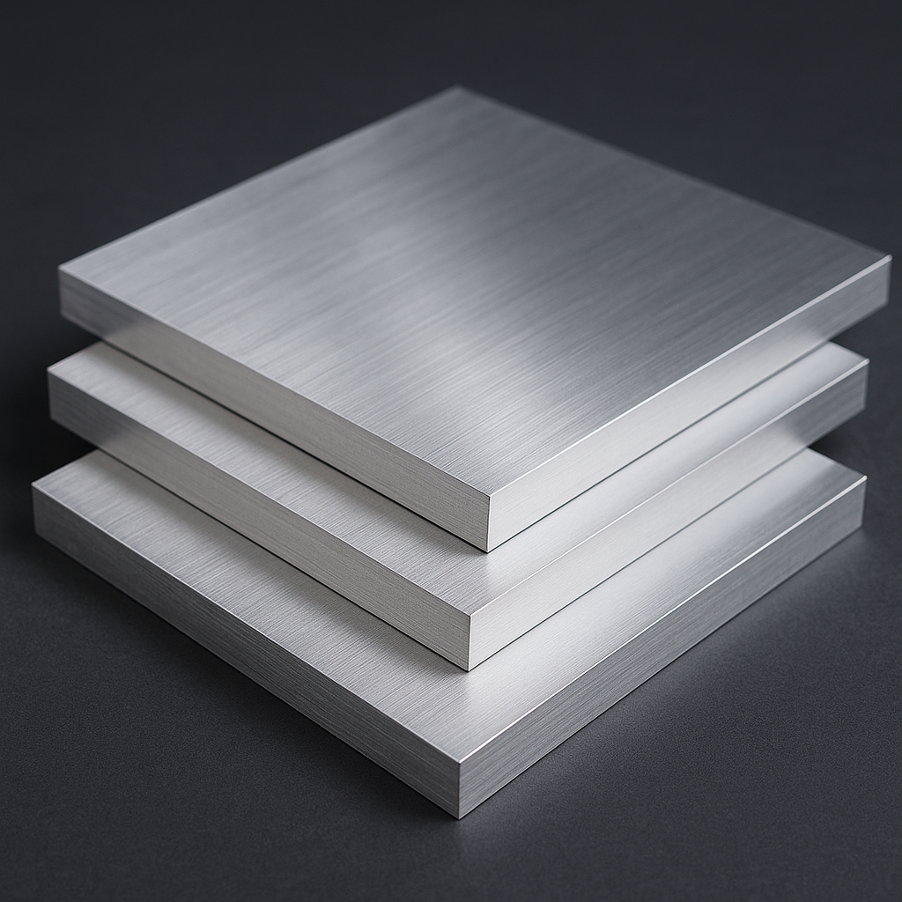
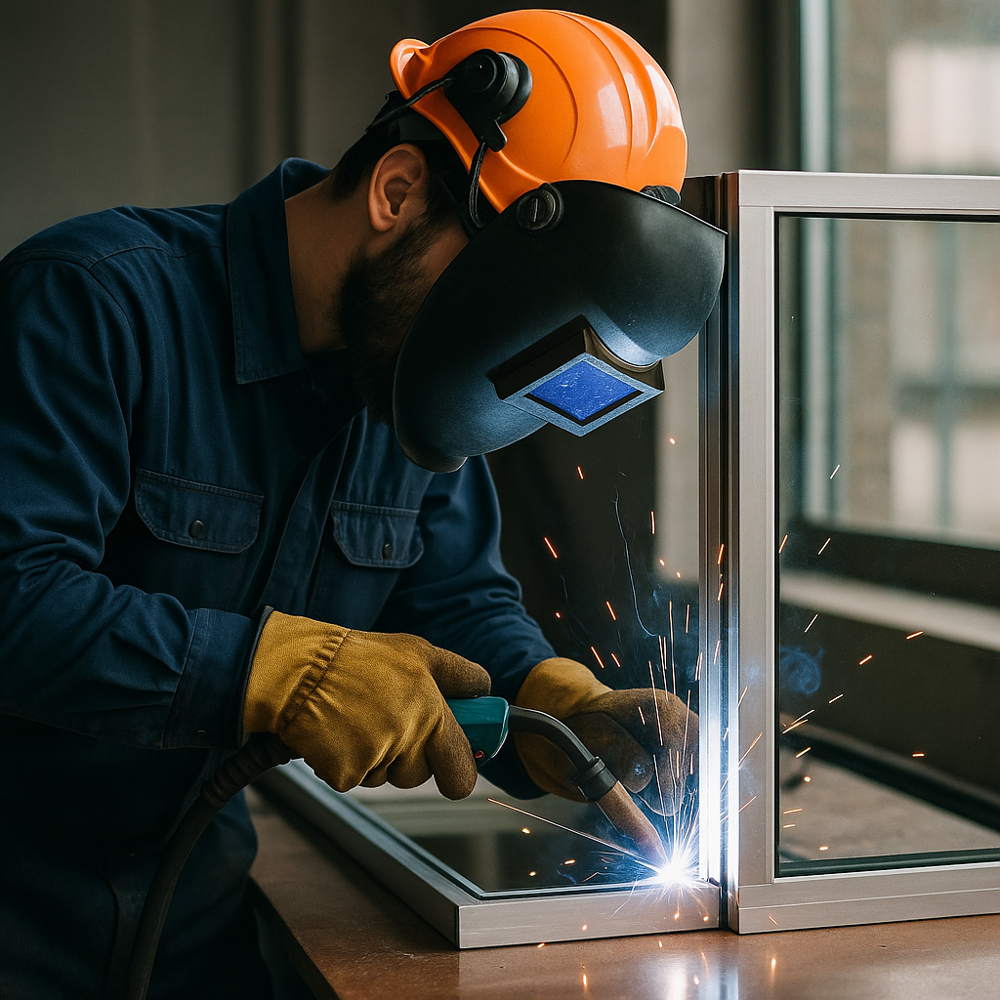

# rafitype1812.github.io
<!DOCTYPE html>
<html lang="id">
<head>
  <meta charset="UTF-8" />
  <meta name="viewport" content="width=device-width, initial-scale=1.0" />
  <title>Toko Aluminium & Baut Mur</title>
  <link rel="stylesheet" href="toko2.css" />
</head>
    
<body>
  <header>
    
<a href="toko2.html">🔩 Barakah Aluminium</a>

    <nav>
      <a href="toko2.html">Beranda</a>
      <a href="#produk">Produk</a>
      <a href="#tentang">Tentang Kami</a>
      <a href="#kontak">Kontak</a>
    </nav>
  </header>

  <section class="hero">
  

    

    

    

    <!-- Tombol manual -->
    <button class="slide-btn prev">&#10094;</button>
    <button class="slide-btn next">&#10095;</button>
  

  

    <h1>Solusi Kuat untuk Konstruksi Anda</h1>
    

      <a href="#produk" class="btn btn-orange">Lihat Produk</a>
      <a href="#" class="btn btn-outline" id="katalogBtn">Katalog PDF</a>
    

  

</section>

  <section id="produk" class="produk">
  <h2>Kategori Produk</h2>
  

    
    

      <a href="alumunium.html">
        
        
Alumunium

      </a>
    

    

      <a href="kaca.html">
        
        
Kaca

      </a>
    

    

      <a href="bautmur.html">
        
        
Baut Mur & Ring

      </a>
    

    

      <a href="jasa.html">
        
        
Jasa Pembuatan

      </a>
    

  

</section>

  <section id="katalog" class="keunggulan">
    <h2>Keunggulan Kami</h2>
    

      
📦 Stok Lengkap

      
🚚 Pengiriman Cepat

      
🛡️ Kualitas Terjamin

      
📞 Konsultasi Gratis

    

  </section>

  <section id="tentang" class="testimoni">
    <h2>Testimoni Pelanggan</h2>
    

      <blockquote>
        
Produk sangat berkualitas dan pengirimannya cepat!

        <cite>– Budi, Kontraktor</cite>
      </blockquote>
      <blockquote>
        
Langganan di sini karena lengkap dan responsif CS-nya.

        <cite>– Sari, Bengkel Teknik</cite>
      </blockquote>
    

  </section>

  <section id="kontak" class="kontak">
    <h2>Hubungi Kami</h2>
    <form id="kontakForm">
      <input type="text" id="nama" placeholder="Nama Lengkap" required>
      <input type="email" id="email" placeholder="Email" required>
      <textarea id="pesan" placeholder="Pesan Anda" rows="5" required></textarea>
      <button type="submit">Kirim Pesan</button>
    </form>
  </section>

  <footer>
    

      

        <h3>Toko Konstruksi</h3>
        
Menjual berbagai kebutuhan aluminium dan fastener   terbaik untuk industri dan konstruksi.

      

      

        <h4>Kontak</h4>
        
Email: barokahalumunium@gmail.com

        
Telp: 0831-0781-9553

        
Alamat: Barokah Alumunium Sukorejo, W27J+WJC,   Beteng, Tamping Winarno, Kec. Sukorejo,  Kabupaten Kendal, Jawa Tengah 51363

      

      

        <h4>Ikuti Kami</h4>
        
Instagram   Facebook   WhatsApp

      

    

    
© 2025 Toko Konstruksi. Semua hak dilindungi.

  </footer>

  

  </script>
</body>
</html>
